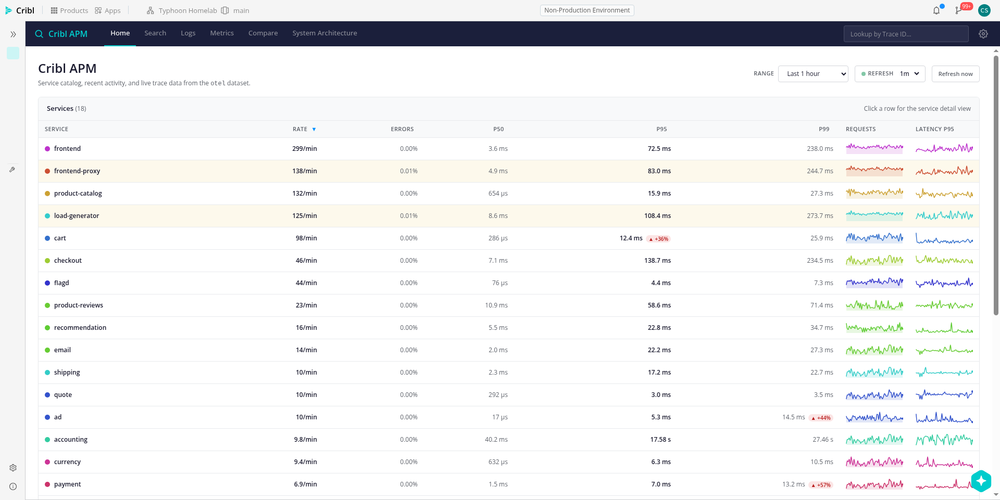
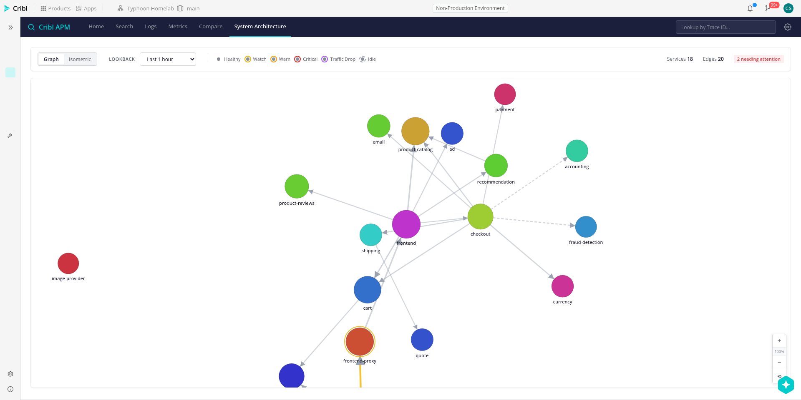
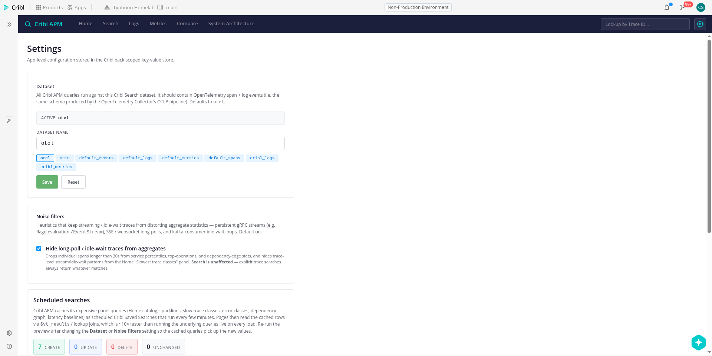
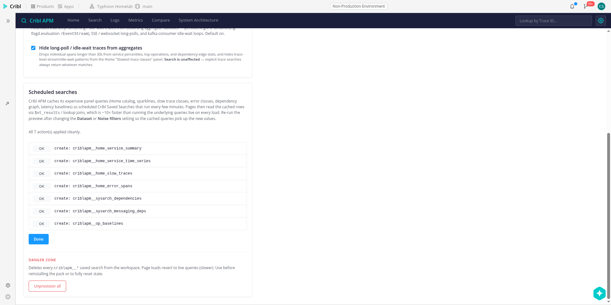
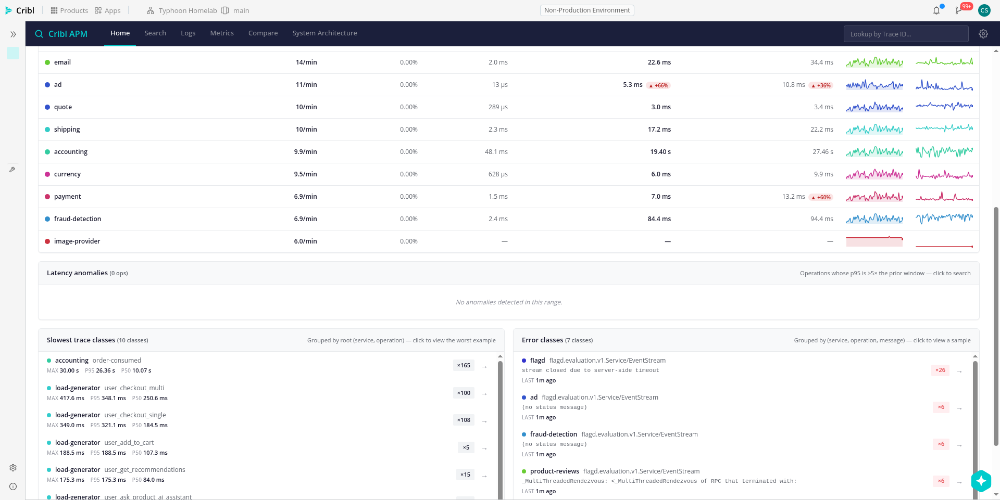
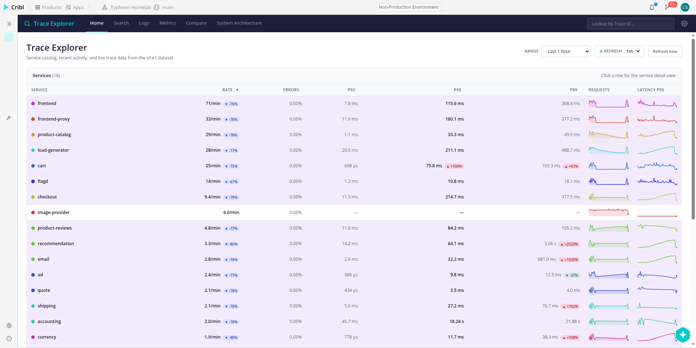

# Session 2026-04-11 — Durable baselines + panel caching (ROADMAP §2b)

Shipped the scheduled-search provisioner and wired both Home and
System Architecture to read panel data from `$vt_results`, plus
re-enabled the latency-anomaly widget against the
`criblapm_op_baselines` lookup. Staging deployment is live with
all seven scheduled searches provisioned.

## Validate from your phone

Point your phone browser at the staging app:
**https://main-objective-shirley-sho21r7.cribl-staging.cloud/apps/oteldemo/**

| What to check | Expected |
|---|---|
| Home catalog loads fast | ~3 s warm-tab (was ~8 s). Rows + sparklines + delta chips all render. |
| System Architecture loads fast | ~3 s after clicking the tab (was ~15 s). 18 nodes + 20 edges. |
| Settings → Scheduled searches panel | Click **Preview plan** → should show **7 Unchanged** (or some mix if you've fiddled). No Apply click needed unless you want to re-run. |
| Latency anomalies widget (Home, below the catalog) | Should show empty state "No anomalies detected in this range" — correct, because the 24 h baseline was taken while the kafka scenario was running, so nothing is >5× its own baseline right now. This is the limitation ROADMAP §2b.1 documents. |
| Navbar + hero title | Reads **"Cribl APM"** everywhere (renamed from "Trace Explorer" this session). |
| Kafka lag detection — traffic_drop | Flip `kafkaQueueProblems` via `scripts/flagd-set.sh kafkaQueueProblems on`, wait ~5 min, reload Home. Services should tint purple with "-NN% vs prior" delta chips. Flip back off with `scripts/flagd-set.sh kafkaQueueProblems off`. |

## What shipped (PR list)

1. **#1 — Repo scaffolding** (MCP wiring, browser automation scripts, nav fix, drop unused dep)
2. **#2 — Service Detail metric cards** (dependency latencies / runtime / infrastructure panels, batched single-query fetch)
3. **#3 — Kafka lag signals: traffic_drop health bucket + parked anomaly widget** (story arc leading to ROADMAP §2b)
4. **#4 — Research: ROADMAP §2a complete** (Cribl saved-search REST surface, persistence mechanisms, POST shape, notification targets)
5. **#5 — Rename: Trace Explorer → Cribl APM** (user-facing strings + identifiers)
6. **#6 — Scheduled-search provisioner + Settings UI panel**
7. **#7 — Panel cache wiring: Home + System Architecture from `$vt_results`**
8. **#8 — Anomaly detector reads durable baseline + widget re-enabled**

Each PR is stacked on the previous one so mobile review shows just
that chunk's diff.

## Screenshots

### Home catalog — loaded from cached `$vt_results`

Services, sparklines, latency columns, delta chips all render in
~3 s warm-tab, down from ~8 s. Query count went from 5-7 live
panel queries to 1 batched `$vt_results` read + 1 live prev-window
query.

### System Architecture — force-directed graph from cache

18 nodes, 20 edges. Loads in ~3 s after clicking the tab (was ~15 s
because the dependency self-join is expensive). Two nodes tinted
for warn state. `frontend-proxy` shows a warn halo.

### Settings → Scheduled searches — provisioning preview

Brand-new Settings section. Click "Preview plan", see the
create/update/delete/noop counts (7 CREATE on first run), expand
the action list to see each planned saved-search ID. Apply button
appears only when there are changes.

### Settings → Scheduled searches — applied result

All seven creates succeeded. First-time run is idempotent —
clicking Preview again immediately shows 7 UNCHANGED.

### Latency anomalies widget — empty state (current)

The widget renders at the top of the slow-classes row and currently
shows its empty state. Expected: the 24 h baseline in
`criblapm_op_baselines` was materialized while the kafka scenario
was still running, so `accounting.order-consumed` has baseline p95
≈ 26 s vs current p95 ≈ 26 s (ratio 0.99×). No ops cross the 5×
threshold right now. Turn the kafka scenario off and wait for the
next hourly baseline run — the widget will wake up.

### Traffic drop — kafka scenario detection

Historical capture from earlier in the session when
`kafkaQueueProblems=on`: every service row tinted purple with
"-76% vs prior" delta chips. The `traffic_drop` health bucket
catches the starved-consumer cascade without needing error rates
to light up.

## Known limitations (not bugs)

- **Baseline is currently poisoned.** `criblapm_op_baselines` was
  computed while the kafka scenario was running, so it captured
  26 s p95 for `accounting.order-consumed` as "baseline". Flip
  the scenario off, wait for the top of the next hour for the
  baseline search to fire, and the detector will wake up on the
  next comparison.
- **Auto-refresh every minute re-runs the two live queries** (prev
  summary + cache read). Could be cached too but the prev window
  changes with every user range pick, so it's a harder ask.
- **Stream-filter toggle disables the cache path.** Cached queries
  bake in the filter state at provision time. When you toggle it
  off in Settings, pages fall back to live queries until you
  re-run Preview + Apply in the Settings provisioning panel.

## Next up (tomorrow)

- **ROADMAP §2c** — user-facing alerts. Same REST surface as §2b,
  just adds a notification item to any saved search. "Create alert"
  button on Home catalog rows + Service Detail.
- **ROADMAP §2d** — SLO budgets. Thin layer on top of §2c, needs
  a burn-rate saved search.
- **§2e first-run dialog** — lift the `ProvisioningPanel` component
  into a modal that shows on fresh install when the
  `criblapm__provisioned_version` KV key is missing.

## Working agreement for remote days

From today onward when you're mobile:

1. Deployed staging is the authoritative validation surface — not
   my screenshots.
2. I commit session logs like this one under
   `docs/session-logs/YYYY-MM-DD-<slug>/` with inline screenshots
   and a validation checklist.
3. Meaningful work ships as a chunked PR series targeting `master`,
   stacked so each PR diff is one chunk.
4. I push before you step away.
