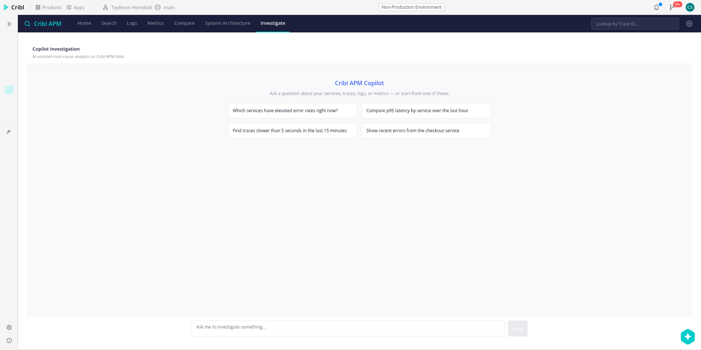
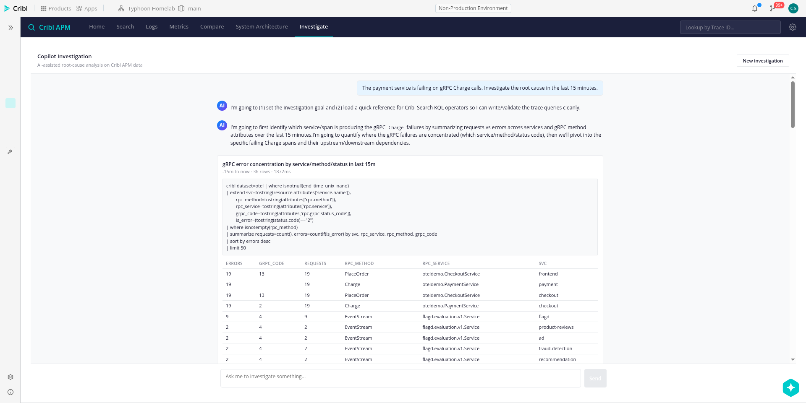
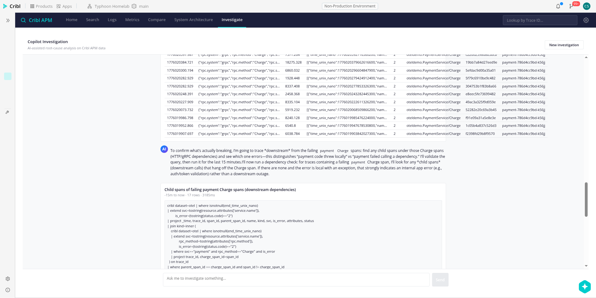
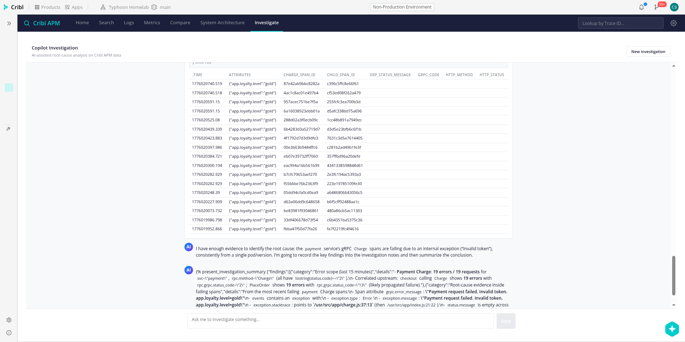

# Session: Copilot Investigator implementation (2026-04-12)

Follow-up to the morning's API spike (`2026-04-12-investigator-spike.md`
and `docs/research/copilot-investigator.md`). Goal: build the foundation
and a standalone chat route for an embedded Copilot Investigator inside
the Cribl APM app, backed by `/api/v1/ai/q/agents/local_search`.

## What shipped

Branch: `copilot-investigator` → PR #14

New modules in `oteldemo/src/api/`:

- **`agent.ts`** — streaming NDJSON client + typed frame parser for the
  agent endpoint. Yields `text`, `toolCalls`, `toolResult`, `notification`
  frames via an async generator. Handles partial-line buffering across
  chunk boundaries and supports AbortSignal cancellation.
- **`agentContext.ts`** — APM context preamble builder. Includes dataset
  shape (OTel pre-parsed JSON, not raw), field mappings
  (`tostring(resource.attributes['service.name'])` etc.), **the
  bracket-quoted dotted-field rule** Clint called out (`["service.name"]`,
  not `service.name`), KQL dialect notes (`summarize` not `stats`, etc.),
  example working queries copied from our query layer, and optional
  overrides for service/operation/known-signals/topology injection.
- **`agentTools.ts`** — client-side tool dispatcher. Implements
  `run_search` against our existing `runQuery`; stubs the tools we
  redirect (`get_dataset_context`, `sample_events`) with pointers back
  to the pre-provided context so the agent doesn't waste round-trips.
- **`agentToolDefs.ts`** — the `tools` array sent to the agent endpoint.
  Without this, the agent falls back to text-only mode and refuses to
  run searches. Contains `run_search`, `update_context`, and
  `present_investigation_summary` definitions captured from the native
  `/search/agent` UI's request.
- **`agentLoop.ts`** — conversation orchestrator with event-emitter
  interface for the chat UI reducer. Handles the full tool-use loop:
  POST → stream → execute tool → append → POST again, with safety net
  for max turns and graceful abort handling.

New route:

- **`routes/InvestigatePage.tsx`** — chat UI with streaming transcript,
  inline Run Query approval cards, result tables, minimal markdown
  renderer for assistant responses. Empty-state suggestions,
  "Stop" / "New investigation" header actions.

Wiring:

- `/investigate` route in `App.tsx`
- `Investigate` nav tab in `NavBar.tsx` and `package.json` navItems

## End-to-end result

Turned on `paymentFailure 50%`, submitted `"The payment service is
failing on gRPC Charge calls. Investigate the root cause in the last
15 minutes."`, auto-approved Run Query cards. Agent ran 5+ queries,
used our field mappings correctly (no regex on `_raw`), and identified:

- **Root cause**: `"Payment request failed. Invalid token"` thrown from
  `/usr/src/app/charge.js:37:13`
- **Affected pod**: `payment-786d4cc9bd-k56jj` running version `2.2.0`
- **Upstream propagation**: checkout `PlaceOrder` showing 19 errors with
  `rpc.grpc.status_code="13"` (propagated failure)
- **Correlation**: all failing Charge spans carry
  `app.loyalty.level=gold` in their attributes

This is a meaningfully deeper finding than the morning's native-UI spike
reached in 10+ minutes — and this run completed in ~2 minutes with the
embedded context pre-filled.

### Screenshots

*Empty state with gradient "Cribl APM Copilot" header and suggestion cards.*

*First `run_search` tool call rendered as an inline card with query,
time range, duration (`1872ms`), row count (`36 rows`), and real
result table showing payment/Charge with 19 errors plus upstream
propagation to checkout.*

*Third query drilling into the actual failing spans — exception
stack trace clearly visible in the results.*

*Agent attempted `present_investigation_summary` but it rendered as
raw `` text instead of a dedicated "Final Report" card.
Known polish item — see next steps.*

## Key bug fix during the session

**`tools` array was missing from the request.** Without it the agent
refuses to run searches ("I can't execute searches against your otel
dataset from this chat session"). First smoke test had 0 search jobs,
agent dumped KQL as markdown. Fix was to capture the tool schemas from
the native UI's request and ship them in `agentToolDefs.ts`.

## Verification constraints hit

- The Cribl App Platform shell iframes the app with an opaque URL, so
  Playwright scripts must find the app frame by locating our composer
  textarea, not by frame URL.
- The shell at `/apps/oteldemo/` requires an authenticated session —
  new tabs opened via `context.newPage()` don't always inherit cookies.
  Workaround: reuse the existing logged-in tab.
- Session cookies on the `/apps/` path expire and the script can't
  re-authenticate. User has to re-login manually when this happens.

## Next steps (cross-session)

### This PR (if scope permits)

1. **`present_investigation_summary` rendering** — currently renders as
   raw `` text in assistant message. Detect this tool call in
   the transcript reducer and render as a dedicated "Final Report" card
   with category headings, markdown details, and conclusion.
2. **`validate_kql` handling** — agent occasionally tries this tool
   (not in our array). Our dispatcher returns "Unknown tool" and the
   agent recovers on the next turn. Harmless but wasteful. Either add
   a stub that returns "valid" or update our context preamble to
   explicitly discourage calling it.

### Follow-up PRs (integration points)

Each is an `InvestigateButton` component that navigates to `/investigate`
with a seeded `InvestigationSeed` in location state. The seed builder
(`buildSeedPrompt`) already supports service, operation, knownSignals,
topology, earliest/latest overrides.

1. **Home catalog rows** — "Investigate" button on hover, pre-fills
   service name + error rate + health bucket from the row. Known-signal
   examples: "Error rate 4.60% (baseline 0.12%)", "p95 ▲ 22.56pp vs
   previous window".
2. **System Architecture edges** — edge tooltip gets an "Investigate"
   button that pre-fills both endpoints + edge call count + error rate.
3. **System Architecture nodes** — same, for service-level
   investigation from the node tooltip.
4. **Service Detail page** — top-right action button, pre-fills service
   + current anomalous operations from Top Operations table.
5. **Trace Detail** — "Investigate this trace" action that pre-fills
   trace ID + root service + error spans in the trace.
6. **Anomaly widget** — each row becomes clickable and opens an
   investigation pre-filled with the anomaly context (op, ratio,
   current p95 vs baseline).

### Additional polish (any PR)

- **Auto-approve mode** — a user toggle in the Investigate page (or
  Settings) to skip Run Query approval. Useful for "just do it" mode
  when the user trusts the agent.
- **Abort per-turn** — the current Stop button aborts the whole loop.
  A per-query cancel would let users skip a specific search without
  killing the whole investigation.
- **Token streaming latency** — measure end-to-end turn latency and
  find out if there's a way to get earlier first-token display.
- **Transcript persistence** — KV-store the transcript so navigating
  away and back doesn't lose the conversation. Optional, but valuable
  if investigations get linked from elsewhere.

### Protocol investigation (followup research)

- **Why did the agent occasionally call `validate_kql`?** — not in our
  tools, not documented in the API spike. Maybe it's a server-side
  synthesized tool. Would be worth understanding so we can decide
  whether to register it.
- **Can we skip `get_dataset_context` entirely?** — the spike noticed
  the agent still fetches field stats sometimes even with the context
  pre-filled. We told it not to in the preamble, but sometimes it
  still does. Look into how the native UI persuades the agent to
  skip it — maybe there's an `enabled` flag in tool defs or a system
  message we're missing.
- **`fetch_local_context` RAG retrieval** — a server-side RAG call
  returning KQL examples. Our preamble already contains examples, but
  the agent still triggers this tool occasionally. Worth understanding
  whether we can pre-populate this.
