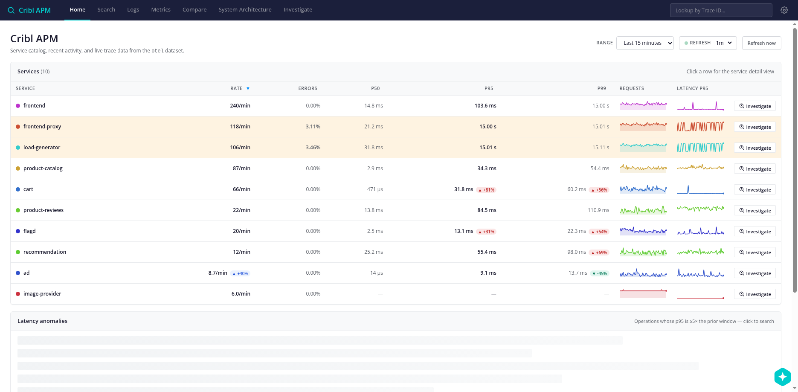
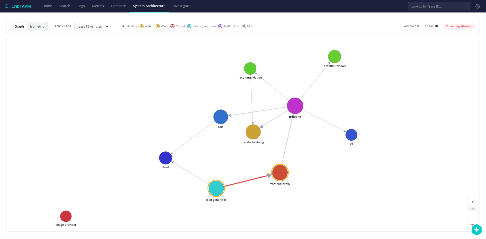
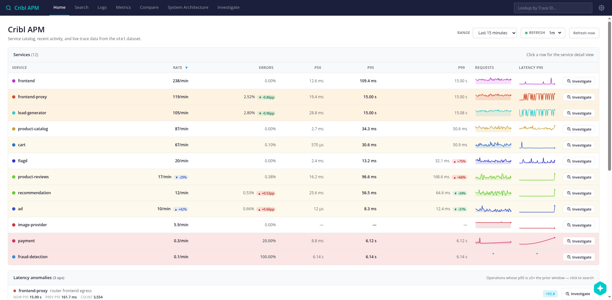
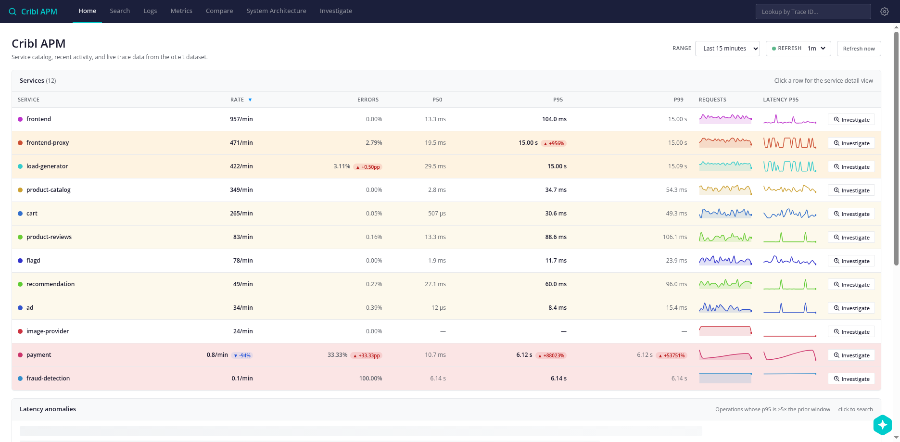
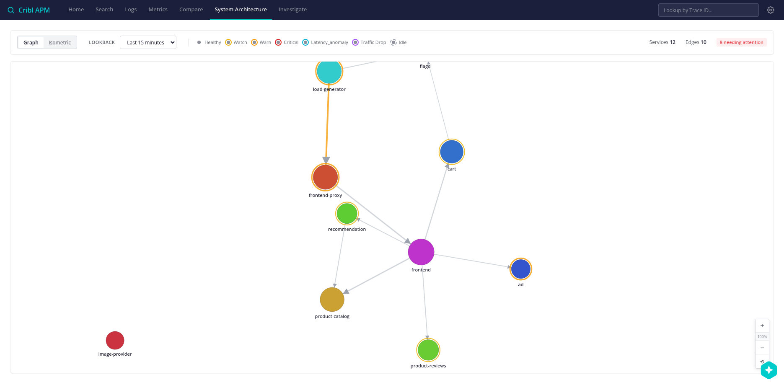

# Session 2026-04-12 — Error-scenario evaluation (UI vs Copilot Investigator)

Paired-surface evaluation of five flagd error-injection scenarios against
both the Cribl APM UI (Home, System Architecture, Service Detail) and the
embedded Copilot Investigator. Goal: score where each surface succeeds
and fails *independently*, and turn every miss into a concrete follow-up.

Driver: `/tmp/apm-drive.mjs` (ad-hoc Playwright/CDP script attached to
the user's VNC Chromium). Each scenario flipped via
`scripts/flagd-set.sh <flag> on`, then ~150s wait for telemetry to land
before capturing.

All raw artifacts (Home screenshots, Architecture screenshots, full
Investigator transcripts per scenario) are under
`/tmp/scenario-results/<flag>/` on the author's machine; the canonical
screenshots are copied into `screenshots/2026-04-12-scenario-eval/`.

## Scoreboard

| # | Flag | Flag fires? | UI | Investigator | Time |
|---|---|---|---|---|---|
| 1 | `cartFailure` | yes (Redis down) | ⚠ misattributes — tints *callers*, cart row 0% | ✅ perfect — exact error, stack, rendered trace | 131s |
| 2 | `adFailure` | **no** (0 error spans on ad) | tiny +0.66pp watch chip | ❌ reported stale cart/Redis (window bleed-over) | 177s |
| 3 | `productCatalogFailure` | **no** (20 calls to target product, 0 errors) | no signal | ❌ reported flagd disconnect noise | 93s |
| 4 | `paymentUnreachable` | yes (pod fully down) | ✅ payment row unmissable (33% err, p95 6.12s ▲+88023%, rate ▼-94%) — but **arch graph drops the payment node entirely** | ❌ biggest miss — anchored on stale cart noise, never noticed rate collapse | 106s |
| 5 | `llmRateLimitError` | **no** (0 errors on product-reviews) | no signal | ❌ reported flagd disconnect noise | 89s |

Direct KQL verification confirmed three flags produce zero
`status.code=2` errors in traces: `adFailure`, `productCatalogFailure`,
`llmRateLimitError`. Either the upstream OTel demo's flag wiring has
regressed, or the flags need conditions we're not meeting (e.g.
`llmInaccurateResponse` only fires when a specific product is
navigated to). Either way, `FAILURE-SCENARIOS.md` is **stale** on
those three rows.

## Key per-scenario findings

### 1. cartFailure — reference "wow moment"

**UI behavior (shown above).** Home catalog tints `frontend-proxy` and
`load-generator` red with p95/p99 hitting the 15-second gRPC deadline
floor. The actual failing service, `cart`, shows `0.00%` errors and no
chip. Architecture view (next image) highlights the
`load-generator → frontend-proxy` edge in red but doesn't mark the
downstream cart dependency.

A human scanning the catalog goes to frontend-proxy first and has to
drill their way back to cart. This is a *classic APM pitfall* — the
row with the loudest red chip is almost never the root cause; it's
the caller whose outgoing span timed out. Our Home row and arch-edge
logic measures "errors originated at the server side of this span"
so errors attributed upstream stay invisible at cart's row.

**Investigator behavior.** Free-form prompt ("Something is broken in
the last 15 minutes, find the root cause, show a failing trace")
completed in **131 seconds** with the correct answer:

> Can't access cart storage. System.ApplicationException: Wasn't able
> to connect to redis
>   at cart.cartstore.ValkeyCartStore.EnsureRedisConnected()
>   at cart.cartstore.ValkeyCartStore.EmptyCartAsync(String userId)

Plus user-visible impact (`504 Gateway Timeout` on `/api/checkout`,
`response_flags: UT`), the full propagation chain, and a rendered
15.25-second representative trace. This is the reference case — ship
this flow in demos.

Full transcript: `/tmp/scenario-results/cartFailure/inv/transcript.txt`.

### 2. adFailure — both surfaces miss; flag appears dead

**Direct verification.** In the 10 minutes after flipping:
- 3 error spans on service `ad`, all on
  `flagd.evaluation.v1.Service/EventStream` (side effect of bouncing
  flagd during flag flip, not the flag under test)
- Zero errors on actual AdService operations

**UI behavior.** `ad` row: `0.66% errors ▲+0.66pp`, yellow "watch"
tint. Below noise floor. `frontend-proxy` and `load-generator` are
still tinted red from cartFailure window-bleed. An analyst would
investigate cart/frontend-proxy, not ad.

**Investigator behavior.** 177 seconds, reported the full cart Redis
error as the root cause — complete hallucination based on stale
telemetry in the lookback window. Also surfaced the flagd
`EventStream` disconnects as a "secondary failure," which is a
self-inflicted artifact of the `flagd-set.sh` deployment bounce
triggering reconnect events across every subscriber.

Two structural problems this run exposed:

1. **Sequential test bleed-over.** 3 minutes of flag-on data competes
   with 12 minutes of prior-test residue in the 15-minute window.
2. **flagd-subscriber disconnect spans look like a "big outage"** to
   the agent because they touch 6+ services simultaneously.

### 3. productCatalogFailure — targeted flag, nothing ever fires

**Direct verification.** Target product `OLJCESPC7Z` got 20
`GetProduct` calls in the 5-minute window. All returned with
`status.code=0`. No exceptions in span events.

**UI behavior.** `product-catalog` row: zero errors, no chip, no
tint. Traffic rate jumped ~300% across the board but that was a
post-scenario recovery bounce, not an error signal.

**Investigator behavior.** 93 seconds, reported "infrastructure
down: flagd ECONNREFUSED + Redis unreachable." Never looked at
`product-catalog` specifically. Same two problems as #2.

### 4. paymentUnreachable — best UI signal, worst Investigator miss

**UI behavior.** The `payment` row on Home is *unmissable*:

| metric | value | chip |
|---|---|---|
| rate | 0.8/min | ▼-94% |
| errors | 33.33% | ▲+33.33pp |
| p95 | 6.12s | ▲+88023% |
| p99 | 6.12s | ▲+53751% |

Red row background, four red delta chips. Any human drills in here
immediately. Home is the best surface for this scenario by a wide
margin.

**UI gap on Architecture.** Note that in the graph above there is
**no `payment` node at all**. When a service goes fully dark, its
span volume drops below the catalog's inclusion threshold and it's
omitted entirely from the System Architecture view. The "2 needing
attention" badge fires but there's no clickable `payment` circle
because the thing we care about disappeared. Real product gap —
the blast-radius topology is the wrong surface for "what just went
completely silent" questions.

**Investigator behavior.** 106 seconds, came back with **"ROOT
CAUSE: REDIS/VALKEY CONNECTIVITY FAILURE"**. Payment was listed in
a side table (8 requests, 33% errors) but the agent never asked
*why payment's rate collapsed*, never ran a query against payment
as a server, never flagged that payment had stopped emitting new
spans 6 minutes before the snapshot. The dominant signal in its
first summary query — cart with thousands of historical requests vs
payment with a handful — made it anchor on cart. And the flagd
disconnects on payment-side client spans were read as "flagd is
broken."

This is the scenario where the UI and Investigator diverge most. If
a user sees the UI first (red row, click in) they get the right
answer in 10 seconds. If they ask the Investigator first (free-form
prompt) they get a wrong answer in 106 seconds. **Same dataset.**

### 5. llmRateLimitError — third dead flag

**Direct verification.** 8 `chat astronomy-llm` spans in 3 minutes,
8 `POST`, 5 `GetProductReviews`, 4 `AskProductAIAssistant` — all
`status.code=0`. No event exceptions.

**UI behavior.** `product-reviews` row: `0.33% errors`, no chip,
rate `+352%` (blue neutral chip). Nothing alarming.

**Investigator behavior.** 89 seconds. Reported "flagd service
unavailable at 10.96.141.153:8013." Never mentioned LLM, rate
limits, or `product-reviews`. Same failure mode as #2/#3.

## What these runs expose

### Investigator gaps (impact-ordered)

1. **No traffic-drop detection pass.** Today the agent only queries
   error *counts* and error *rates*. In `paymentUnreachable` the
   loudest signal is payment's per-minute request count falling to
   near-zero. Adding a "which services' per-minute rate fell ≥50%
   vs their prior window?" sweep early in the loop would catch
   every unreachable-service scenario. The same check already
   powers Home's `traffic_drop` health bucket — we just haven't
   told the agent about it.

2. **No time-window discipline.** The 15-minute lookback plus the
   preamble's default `-15m` earliest param means sequential
   scenarios bleed into each other. Fixes at two levels:
   - **Prompt-level**: add a "run an error-histogram per minute
     first, distinguish recent from old signal" instruction to the
     preamble. Cheap, applies immediately.
   - **Code-level**: respect user phrasing — when the question says
     "right now" / "in the last 5 minutes", tighten `earliest`
     before running the first query.

3. **flagd EventStream disconnect spans look like a real outage.**
   Every flag bounce produces a burst of `14 UNAVAILABLE` spans
   across 6+ subscribers simultaneously — which is exactly what a
   fanned-out outage looks like to the agent. Three options:
   - Filter `unsanitized_span_name` containing
     `grpc.flagd.evaluation.v1.Service/EventStream` at dataset
     ingest
   - Add a preamble paragraph telling the agent these disconnects
     are expected test noise
   - Use flagd's hot-reload instead of a deployment bounce in the
     test harness

### UI gaps (impact-ordered)

1. **Ghost nodes on System Architecture.** When a service emits
   fewer than N% of its baseline spans in the window, keep its
   node on the graph with a dashed outline and a "no traffic"
   badge, clickable to its last-known Service Detail page. Today
   it just vanishes. Catches `paymentUnreachable`,
   `failedReadinessProbe`, and every blast-radius scenario.

2. **Red "DOWN" state on the rate-column DeltaChip.** The chip is
   currently `relNeutral` mode, so a 94% drop renders the same
   blue color as a 94% surge. A dedicated red treatment for
   `≥50%` drops would make payment's row scream instead of
   mumble.

3. **Root-cause hint derived from span-links.** Home currently
   tints `frontend-proxy` red in `cartFailure` while cart itself
   is 0%. A hint — "row is red because of a downstream dependency;
   see `cart`" — derived from same-trace span-link analysis
   would cut time-to-diagnosis in half on every cascade scenario.
   The Investigator already does this analysis; Home should
   surface it without asking.

4. **Stale-row indicator.** When `payment` still shows
   `0.8/min` but its newest span is 6 minutes old, the UI is
   showing residue as live data. Per-row `last seen Ns ago`
   stamp whenever that exceeds a fraction of the lookback window.

### Test-methodology gaps

- Sequential scenario tests need a **full lookback window of quiet
  time between flag flips**, or the picker has to narrow to `-5m`.
  Otherwise the n-th test is diluted by the (n-1)th.
- `flagd-set.sh`'s **deployment bounce is a telemetry poison**.
  Use flagd hot-reload or add an ingest-time filter for
  `grpc.flagd.evaluation.v1.Service/EventStream` spans.
- Before trusting `FAILURE-SCENARIOS.md` as a regression harness,
  **smoke-test each flag end-to-end**. Three of five are dead as of
  this session. The smoke test itself could be a scheduled Cribl
  saved search that counts errors-per-flagged-service on a rolling
  window and alerts when a known-broken flag produces zero signal.

## Follow-up PRs

- **This PR** (`investigator-scenario-eval`): this session doc, the
  roadmap updates, and a minimal prompt tweak to `agentContext.ts`
  covering traffic-drops and flagd-noise. Low-risk text change; no
  code-behavior change.
- Next: traffic-drop detection pass in the agent (code-level).
  Likely a new client-side "anomaly preflight" that runs before the
  first LLM turn and injects top candidates into the preamble.
- Next: ghost-nodes on System Architecture graph. Node-rendering
  change only; driven by the existing `currentByService` /
  `prevByService` data already on HomePage.
- Next: red DOWN state for DeltaChip rate column. Tiny CSS + prop
  change.
- Later: `FAILURE-SCENARIOS.md` smoke-test as a scheduled search.

## Pointers

- Raw artifacts: `/tmp/scenario-results/<flag>/` on author's machine
  (not in repo — keeps the screenshot set light). Key screenshots
  copied into `screenshots/2026-04-12-scenario-eval/`.
- Driver script: `/tmp/apm-drive.mjs`. Uses `scripts/browser.js` CDP
  helper — no MCP browser server needed.
- Prior Investigator sessions:
  `docs/sessions/2026-04-12-investigator-spike.md` (API spike),
  `docs/sessions/2026-04-12-copilot-implementation.md`
  (implementation), and `docs/research/copilot-investigator.md`
  (protocol + A/B comparison).
