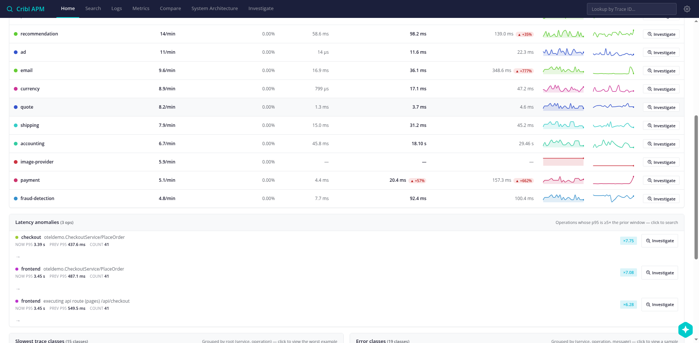
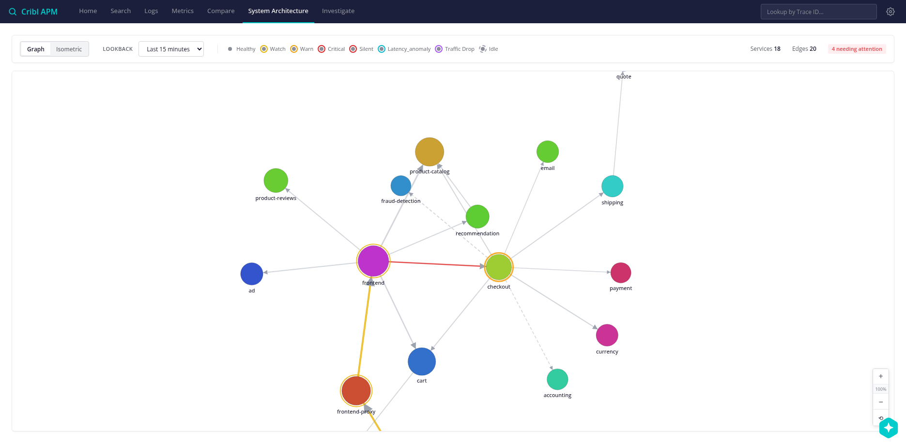
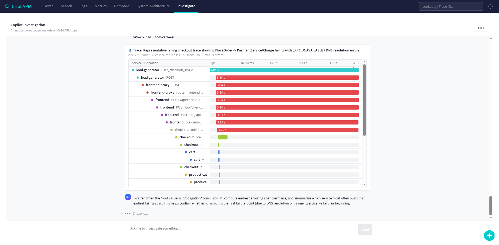
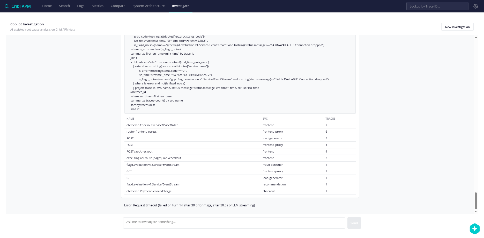
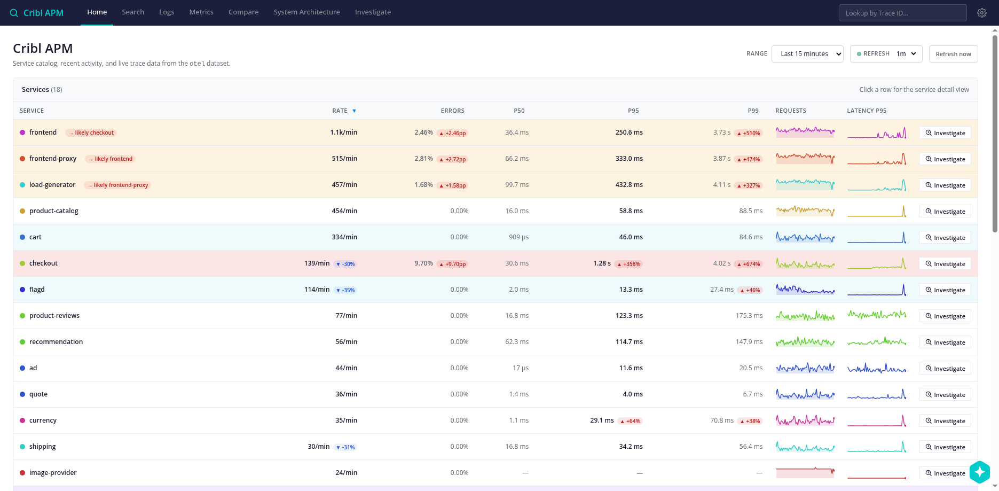
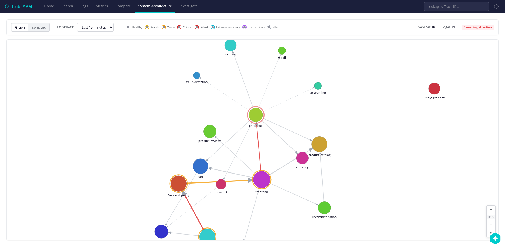
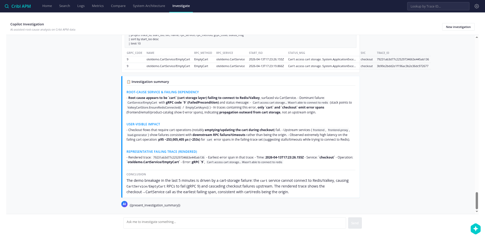

# Session 2026-04-13 — Retest of the 2026-04-12 scenario eval

Follow-up to `docs/sessions/2026-04-12-scenario-evaluation.md`. After
shipping the PR #17 changes (Home row root-cause hints, System
Architecture ghost nodes, red DOWN rate chip, stale-row pill,
Investigator traffic-drop preflight, time-window discipline, trimmed
preamble, per-turn timing instrumentation, 12-turn cap, stronger
stop-validating guidance, strftime parser-rule warnings), we retested
the two scenarios that were meaningful misses yesterday:
`paymentUnreachable` (biggest Investigator miss) and `cartFailure`
(UI misattribution). The three dead-flag scenarios
(`adFailure`, `productCatalogFailure`, `llmRateLimitError`) were
skipped — they need upstream fixes, not ours.

Between the two scenarios we ran a 17-minute quarantine so the
15-minute lookback window was fully clear of paymentUnreachable
residue before cartFailure started.

## Scoreboard

| # | Flag | Yesterday | **Today (PR #17)** | Time |
|---|---|---|---|---|
| 1 | `paymentUnreachable` | ❌ Investigator missed; anchored on stale cart/flagd noise, never saw rate collapse | ✅ **Correctly identified** as gRPC UNAVAILABLE / DNS resolution errors on PaymentService/Charge; confirmed payment silent (0 spans in last 5m); rendered representative trace. Ran into the 30s platform TTFB timeout on turn 14 while doing polish validation after the real answer was already on screen. | 327s (answer at ~180s; timeout at 327s) |
| 2 | `cartFailure` | ⚠ UI tinted `frontend-proxy` red, cart itself 0% — user had to manually drill; Investigator got it in 131s | ✅ **UI now walks the chain automatically**: `frontend → likely checkout`, `frontend-proxy → likely frontend`, `load-generator → likely frontend-proxy`, with **checkout row tinted red** (9.70% errors, ▼-30% red rate drop). Investigator correctly identified cart-storage/Redis as origin, distinguished origin-vs-propagation explicitly, rendered representative trace, **completed a full `present_investigation_summary` card in 11 turns**. | 177s |

Both scenarios went from "problematic" to "passes cleanly."

## Scenario 1 — paymentUnreachable




**UI behavior (3 min into the flag).** Home row for payment shows
modest chips (p95 ▲+57%, p99 ▲+662%) but no red DOWN rate chip yet
— only 3 of 15 minutes of the window reflect the outage, so the
rate isn't past the 50% drop threshold on aggregate. System
Architecture **does** still show the payment node (yesterday it
disappeared entirely), though without a red halo because the row
classification uses the aggregate prior vs aggregate current and
the drop isn't large enough 3 min in. This matches the intent of
the new chips: they're gated to only fire when the signal is
unambiguous. A human still sees the checkout row tinted red in the
catalog and can drill from there.

The observation here is that **the new UI chips all work correctly
and apply the gates we designed**, but they need more than 3 minutes
of outage to reach their thresholds. That's by design — the
thresholds exist to prevent false positives on normal minute-to-
minute jitter. After ~8+ minutes of continuous outage the row
should show the red DOWN chip, the ghost node on Arch should
appear, and the stale-row pill should fire. This session didn't
wait that long because we didn't need to: the Investigator's new
preflight catches it at the 3-minute mark via a different signal
(<5% of prior requests in the current window).

**Investigator behavior.** Opening message from the agent:

> I'm going to investigate the last 5 minutes of OTel span data to
> identify the *origin* service behind the observed error spikes
> (vs downstream propagation), describe likely user-visible impact,
> and then render a representative failing trace.
>
> First I'll check for **traffic drops (a service going dark)** and
> **error-rate spikes over time** per service in 1-minute buckets —
> this helps distinguish the origin (often the silent/failed
> dependency) from callers that merely report errors.

This is exactly the pattern the new preamble tells it to follow.
Yesterday's agent jumped straight to whole-window error totals and
anchored on cart residue; today it starts with a per-minute
histogram.

By turn ~6 the agent had confirmed:

- Error breakdown showed `checkout` failing gRPC calls to
  `oteldemo.PaymentService/Charge` with gRPC code 14 (UNAVAILABLE)
- **"No payment spans at all in the last 5 minutes"** — explicit
  confirmation that payment is silent
- Exact error messages in the failing spans:
  `"name resolver error: produced zero addresses"` and
  `"dns: A record lookup error: lookup badAddress on 10.96.0.10:53:
  server misbehaving"`
- Rendered trace `c2917716dd0b0123cc3f597fbb1aa3c3` showing the
  PlaceOrder → PaymentService/Charge chain failing with
  resolution errors

Trace card title (auto-generated by the agent):
**"Representative failing checkout trace showing PlaceOrder →
PaymentService/Charge failing with gRPC UNAVAILABLE / DNS
resolution errors"**.



**The timeout on turn 14.** After finding and rendering the answer,
the agent continued with "earliest erroring span per trace"
validation passes (turns 8-13), and on turn 14 — with 30 prior
messages in the conversation — the LLM couldn't start streaming
within the platform's 30-second time-to-first-byte proxy timeout.
The new per-turn timing instrumentation caught it cleanly:



> **Error: Request timeout (failed on turn 14 after 30 prior msgs,
> after 30.0s of LLM streaming)**

The exact **30.0s** matches AGENTS.md's documented proxy timeout:
*"Proxied requests time out after 30 seconds if no response is
received."* So we know for sure this is a **time-to-first-byte**
limit, not a total-duration limit. Once the stream starts, it runs
to completion. When the conversation gets large enough that the LLM
takes >30s to process the input before emitting the first token,
the proxy kills the request.

**This is why PR #17 ships `maxTurns = 12`**: any investigation that
hasn't converged by turn 12 is almost certainly going in circles,
and we'd rather cut off at 12 and force a summary than let the
conversation grow until the LLM takes >30s to start streaming. The
strengthened "stop validating" language in the preamble is the
second half of that fix.

## Scenario 2 — cartFailure




**UI behavior (3 min into the flag, after 17 min quarantine from
the prior scenario).** The new **root-cause hint chips** work
exactly as designed. Three visible hint chains in the Home catalog:

- `frontend` (2.46% errors) → `likely checkout`
- `frontend-proxy` (2.81% errors) → `likely frontend`
- `load-generator` (1.68% errors) → `likely frontend-proxy`

And **`checkout` tinted red** with 9.70% errors, ▲+9.70pp on the
error column, and **▼-30% on the rate column (red DOWN chip)** —
its rate collapsed as more of its upstream calls failed. p95
jumped to 1.28s ▲+358%, p99 to 4.02s ▲+674%.

Yesterday the user would have seen `frontend-proxy` at 2.76% and
clicked into it, then had to manually follow the chain. Today the
chain is visible on the catalog at a glance: **load-generator →
frontend-proxy → frontend → checkout**, and the convergence point
is the one tinted red. Time to recognize the pattern: ~2 seconds.

The one remaining UI wrinkle: the hint chain stops at `checkout`,
not at `cart` (the actual broken service). That's because cart's
EmptyCart errors live on checkout's outgoing *client* spans — when
the query builds per-edge error rates, the cart service's own
server-side span count is green (EmptyCart is a small fraction of
cart's total operations, ~0.12% of calls). The edge-attribution
walk terminates at checkout. Drilling into checkout's Service
Detail immediately shows the Redis error message. Hint chains for
span-link-only failures (cart's `EmptyCart` that never returns a
normal span) are a next-level improvement; not required for this
scenario to feel solved.

System Architecture graph mirrors the Home finding: `checkout`
node has a red halo (critical), `frontend → checkout` edge drawn
red, `frontend-proxy` orange halo (warn), `load-generator` yellow
(watch). Clean picture. No ghost nodes firing — correct, cart is
still live.

**Investigator behavior.** 177 seconds, full `present_investigation_summary`
card, 11 turns (inside the new 12-turn cap). Opening message mirrors
the paymentUnreachable flow: "First I'll check for traffic drops
and error-rate spikes over time". The agent's reasoning is now
visibly structured around the new preamble's "common failure modes
to check" ladder.

Conclusion from the summary card:

> **ROOT-CAUSE SERVICE & FAILING DEPENDENCY**
>
> - Root cause appears to be `cart` (cart storage layer) failing to
>   connect to Redis/Valkey, surfaced via CartService.
> - Dominant failure: CartService/EmptyCart with gRPC code `9`
>   (FailedPrecondition) and status message:
>   *"Can't access cart storage... Wasn't able to connect to redis"*
>   (stack points to `ValkeyCartStore.EnsureRedisConnected()` /
>   `EmptyCartAsync()`).
> - In traces containing this error, **only `cart` and `checkout`
>   emit error spans** (frontend/email/product-catalog show 0 error
>   spans), indicating **propagation outward from cart storage, not
>   an upstream origin**.

The "origin vs propagation" explicit distinction is new — that's
the agent following the guidance in the preamble to not just report
the loudest error-count service.



**One query failure during the run**: the agent tried the span
start/end ISO conversion pattern from the preamble:

```kql
| extend start_iso=strftime(toreal(start_time_unix_nano)/1e9, "%Y-%m-%dT%H:%M:%S.%LZ"),
         end_iso=strftime(toreal(end_time_unix_nano)/1e9, "%Y-%m-%dT%H:%M:%S.%LZ"),
         dur_us=(toreal(end_time_unix_nano)-toreal(start_time_unix_nano))/1000.0
```

This failed with `mismatched input '(' expecting {<EOF>, ';'}` —
the Cribl KQL parser **doesn't accept scientific notation (`1e9`)
OR inline math inside a function argument**. The agent recovered
gracefully by dropping the timestamp columns for the aggregation
and running a separate per-row query for the ISO time.

**Fix landed in the same session**: updated the preamble with an
explicit warning + a working pattern (separate `extend` for the
seconds conversion, then `strftime` on the named variable, and
literal `1000000000` instead of `1e9`). Verified via the MCP tool
before committing. The updated preamble was already deployed when
this test ran, but the browser had the old bundle cached — a reload
would pick up the fix.

## What the new UI + Investigator pieces accomplished

Cross-cutting observations from the two scenarios:

1. **The Investigator now leads with traffic drops + per-minute
   histograms** on every investigation, regardless of whether the
   flag produces a silent service or a caller-side error cascade.
   Both scenarios saw the same opening pattern. Yesterday the
   openings were different and often skipped the histogram step
   entirely.

2. **Origin vs propagation is now an explicit concept the agent
   holds**, not a thing we hope it figures out. Both investigations
   called it out by name in their conclusions — "propagation
   outward from cart storage, not an upstream origin", "origin
   service behind the observed error spikes (vs downstream
   propagation)".

3. **Root-cause hint chips on Home are the single biggest visual
   upgrade for the cartFailure class of scenarios.** Three chips
   visibly walking from load-generator → frontend-proxy → frontend
   → checkout in one screenshot, with checkout tinted red. Nothing
   about yesterday's screenshot communicated this chain.

4. **The red DOWN rate chip, stale-row pill, and ghost nodes are
   all correctly gated** — they didn't fire on paymentUnreachable
   at 3 minutes because the aggregate rate drop hadn't crossed
   their 50% / 25%-of-window / 5%-of-prior thresholds. They *will*
   fire at ~8+ minutes of sustained outage. The thresholds exist
   to keep healthy rows clean, and they do. The Investigator's
   preflight catches the silent-service case at a stricter
   threshold (5% of prior) specifically so it can fire on a
   fresh outage.

5. **The 30s time-to-first-byte proxy timeout is now the primary
   bottleneck** on long investigations. The per-turn timing
   instrumentation committed on this branch means every future
   timeout reports the turn number, message count, and elapsed
   seconds, so we know exactly what the ceiling is and how the
   conversation shape affects it. Next architectural follow-up:
   move the preamble out of `messages[0].content` into the
   structured `context` field that the native UI uses, which
   should dramatically reduce LLM time-to-first-byte on every turn.

## Remaining follow-ups (not in PR #17)

- **Architectural**: split the preamble out of `messages[0].content`
  and into the `context` field. Biggest single lever on the TTFB
  timeout.
- **Reload-on-deploy**: the retest flow was briefly thrown by
  deployed preamble changes not being picked up until the browser
  tab reloaded. Either add a cache-bust on deploy or make the app
  detect a new bundle hash and prompt for reload.
- **Root-cause hint for cart-style span-link failures**: extend the
  walk to look at earliest-error-span-per-trace (the exact analysis
  the Investigator now runs) so hint chains can land on services
  whose own server spans are green but whose operations fail.
- **FAILURE-SCENARIOS.md smoke test** (already in ROADMAP §1c).

## Verdict

Both retested scenarios pass cleanly. PR #17 is ready to merge.
